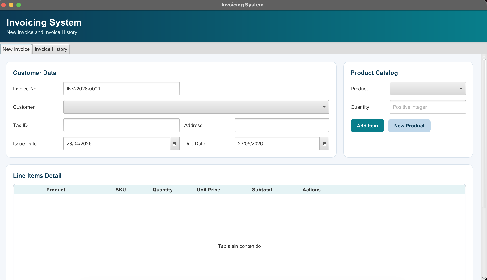
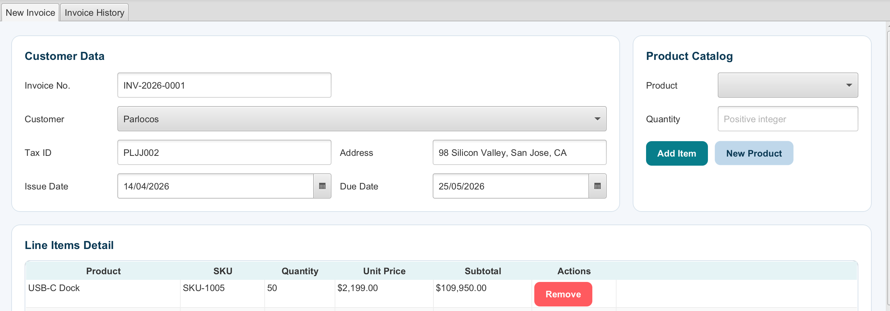
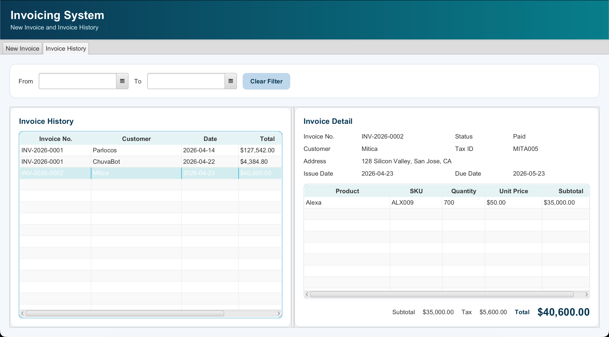
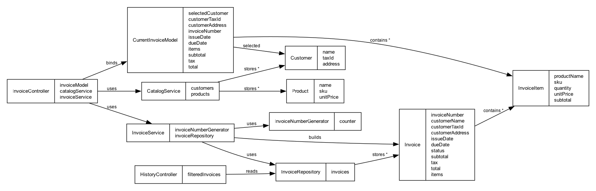

# Invoicing System JavaFX

## Activity Overview
This repository contains the solution for an academic JavaFX lab assignment focused on building a desktop invoicing system with Maven. The activity required the implementation of a New Invoice screen and an Invoice History screen while applying MVC architecture, FXML-based views, reactive bindings, validation rules, and external CSS styling.

## Final Product Description
The final product is a desktop invoicing application that allows users to select customers, choose products, add and edit invoice line items, calculate subtotal, tax, and total in real time, save invoices as drafts or as paid invoices, and review invoice history through date filters and a detailed side panel.

## What Was Implemented
- Maven-based JavaFX project setup.
- MVC architecture with separated model, view, and controller layers.
- FXML views for the main invoice screen, invoice history screen, and new product modal.
- Predefined customer catalog and product catalog.
- Auto-generated invoice number with the `INV-YYYY-XXXX` format.
- Editable line items table with quantity updates and row removal.
- Reactive totals panel using JavaFX properties and bindings.
- Invoice history screen with `SplitPane`, detail panel, and date-range filtering.
- Validation and alert dialogs for user actions.
- External CSS stylesheet for the application interface.

## Application Evidence
The following screenshots show the application running and its main workflows.

| New Invoice Screen | Customer and Product Data Entry |
| --- | --- |
|  |  |

| Invoice History Screen |
| --- |
|  |

## Deliverables
All requested deliverables are included in the `deliverables` folder.

- Demo video: [Open Demo.mov](deliverables/Demo.mov)
- Reflection document: [Open Reflection PDF](deliverables/Sprint%202%20-%20Java%20-%20Reflection.pdf)
- Class diagram image: [Open model-class-diagram.png](deliverables/model-class-diagram.png)

### Class Diagram Preview

## How to Run the Project
### Prerequisites
- JDK 21
- Maven 3.9 or higher

### Steps
1. Clone or download this repository.
2. Open a terminal in the project root folder.
3. Run `mvn clean javafx:run`

## Technical Specifications
- Language: Java
- Java version: 21
- JavaFX version: 21.0.2
- Maven Compiler Plugin: 3.11.0
- JavaFX Maven Plugin: 0.0.8
- Build tool: Maven
- Encoding: UTF-8
- Main class: `com.tec.invoicing.MainApp`

## Authors
- José Emilio Inzunza García | A01644973
- Yael García Morelos | A01352461
- Patricio Blanco Rafols | A01642057
- Arturo Gómez Gómez | A07106692
- Andrés Gallego López | A01645740
